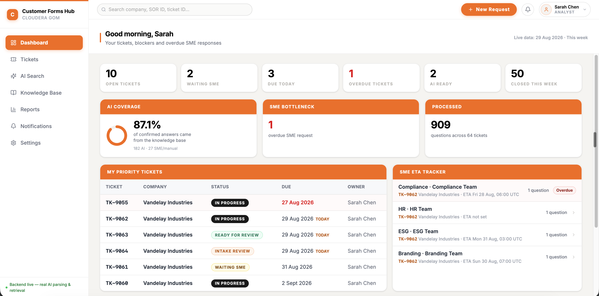
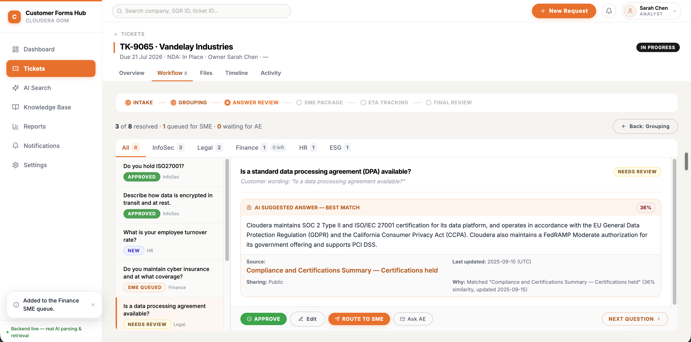
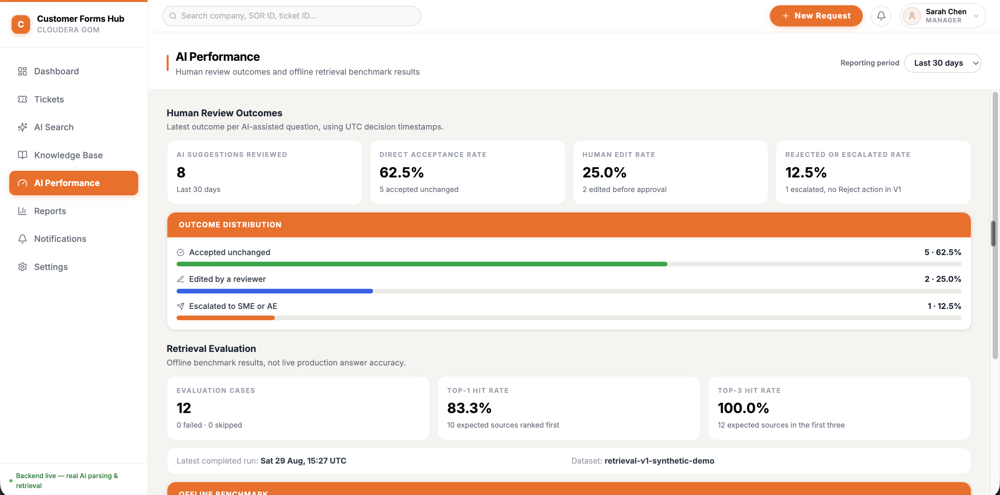
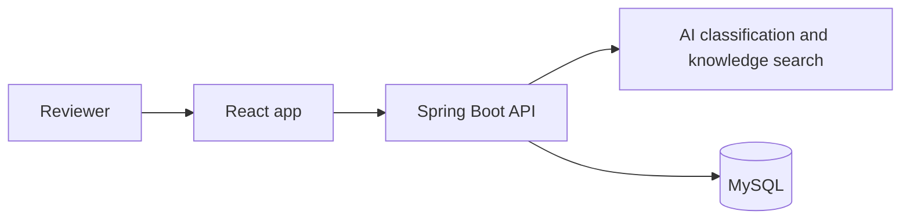

# Customer Forms Hub

[](https://github.com/alisonzzzz-y/customer-form-hub-frontend/actions/workflows/frontend-ci.yml)

> A React app for teams answering customer security and compliance questionnaires.

Customer Forms Hub helps a reviewer upload a questionnaire, find relevant internal knowledge, ask the right people for help, and approve the final response. AI helps with the repetitive parts, but a person always makes the final decision.

This is the frontend for the project. The [Spring Boot backend](https://github.com/alisonzzzz-y/customer-form-hub) handles document processing, AI calls, storage, exports, and the AI Performance data.

## Deployment architecture

The deployed demo is split into four small services:

| Part        | Service       | Responsibility                                                   |
| ----------- | ------------- | ---------------------------------------------------------------- |
| Frontend    | Vercel        | Hosts the React application                                      |
| Backend API | Render        | Runs the Spring Boot API and document workflow                   |
| Database    | Railway MySQL | Stores tickets, questions, knowledge entries, and review data    |
| AI services | OpenAI API    | Classifies questions and creates embeddings for knowledge search |

[Backend repository](https://github.com/alisonzzzz-y/customer-form-hub) · [中文说明](README.zh-CN.md)

[Open the live demo](https://customer-form-hub.vercel.app/)







## What a user can do

```text
Create a customer request
  -> Upload an Excel or Word questionnaire
  -> Check the questions and suggested knowledge sources
  -> Accept an answer, edit it, or ask an SME for help
  -> Track open questions and expected replies
  -> Review and export the completed response
```

The app is a review workspace, not a chatbot. It gives the reviewer useful context, while keeping the reviewer in charge of the final answer.

## My contribution

This frontend was a team project. I set up the main frontend structure and took responsibility for integrating and reviewing the pull requests contributed by my teammate.

## AI Performance page

Managers can see two simple views of how the AI support is being used:

- **Review results**: how often a suggestion was accepted as it was, edited, or sent to an SME or AE.
- **Retrieval check**: whether the backend found the expected knowledge source in its first one or three results.

The retrieval check uses a small synthetic test set. It is useful for checking that search still works after a change, but it is not a claim about real-world answer accuracy. If the backend is offline, the page does not display made-up performance figures.

## How the frontend connects to the backend



All API calls go through `src/app/services/backend.ts`. During frontend work, the app can use a local mock API. The normal workflow screens also have a safe demo fallback when the backend is unavailable.

## Tech used

| Area               | Tools                                     |
| ------------------ | ----------------------------------------- |
| Frontend           | React 18, TypeScript, Vite                |
| UI                 | Tailwind CSS 4, Recharts, Lucide icons    |
| Tests              | Vitest, Testing Library, Playwright       |
| Backend connection | REST API, configured with `VITE_API_BASE` |

## Run it locally

### Use the real backend

```bash
npm install
VITE_API_BASE=http://localhost:8080 npm run dev
```

Open the URL shown by Vite. The status in the bottom-left corner shows whether the app is connected to the backend.

If your backend uses another port, use that port in `VITE_API_BASE` and allow the frontend address in the backend's `CORS_ALLOWED_ORIGINS` setting.

### Use the local mock API

```bash
npm run mock
npm run dev
```

The mock helps with UI work and end-to-end tests. It does not replace the real backend AI features or the AI Performance data.

## Checks

```bash
npm run test:unit
npm run typecheck
npm run build
npm run test:e2e
```

The browser tests cover the main ticket flow, reports, recovery when the API is unavailable, saved changes, and AI review actions.

## Project layout

```text
src/app/
  components/    shared UI pieces
  data/          frontend models and demo data
  pages/         dashboard, tickets, knowledge base, reports, AI Performance
  services/      API connection and local fallback behaviour
e2e/             browser tests
tools/           local mock API
```

## Current limits

- Switching between roles is for the demo. It is not a login or permission system.
- Email actions open a draft with `mailto:`. The app does not send email.
- The AI Performance examples and retrieval test data are synthetic and clearly marked as demo data.
- The system never automatically approves or sends an AI-assisted answer.
